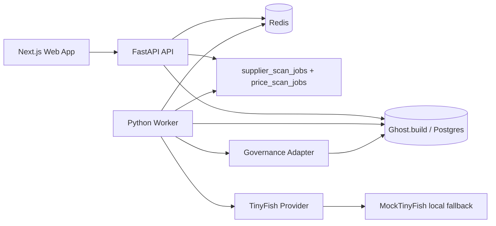

# Architecture

## Modules

- Supplier Risk Radar manages suppliers, evidence, deterministic risk scoring, explanations, and threshold alerts.
- Pricing & Promo Copilot manages products, competitor URLs, price observations, recommendation logic, and evidence-backed explanations.
- Redis context engineering provides a semantic cache (TTL + hit/miss logging), structured agent memory (per-supplier, per-product, recent scans), a retrieval context builder that assembles compact LLM/scoring input, and dedicated job queues (`supplier_scan_jobs`, `price_scan_jobs`). See [context-engineering.md](./context-engineering.md).
- Governance records agent runs, steps, and tool use locally. TODO: forward run metadata to Guild.ai once credentials and API contracts are finalized.

## Data Boundary

All external systems are accessed through interfaces:

- `TinyFishProviderInterface` for search, fetch, browser extraction, and agent runs.
- `RedisContext` for cache, memory, semantic placeholder, and queue primitives.
- `GovernanceRecorder` for Guild.ai-ready run tracking.

Local development does not require paid APIs.

